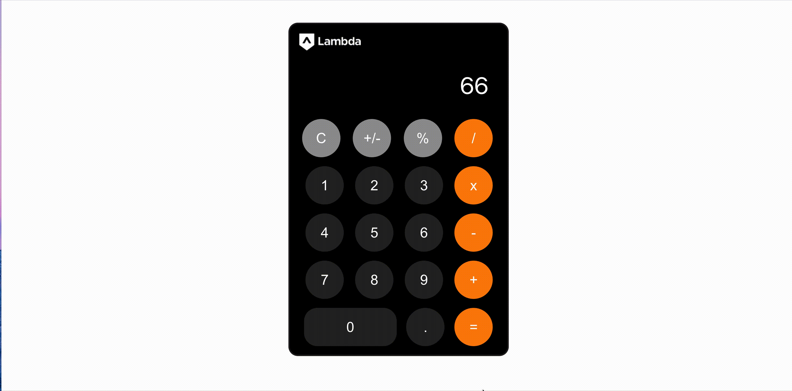

# [React Calculator](https://dorabelme-calculator.netlify.app/)

A Simple React Calculator built with hooks.
[Deployed App](https://dorabelme-calculator.netlify.app/)

## Short demo:

## Installation

1. `git clone git@github.com:dorabelme/lambda-calculator.git`
2. `npm install`
3. `npm start`
